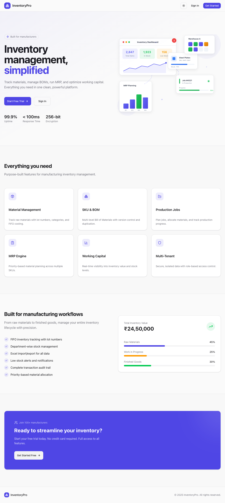

# InventoryPro Documentation

> A comprehensive multi-tenant inventory management system built for manufacturers

## Overview

InventoryPro is a modern, full-featured inventory management solution designed specifically for manufacturing businesses. It provides end-to-end visibility and control over your materials, products, production, and deliveries.

## Key Features

| Feature | Description |
|---------|-------------|
| **Materials Management** | Track raw materials with FIFO batch tracking |
| **SKU Catalog** | Manage finished products and variants |
| **Bill of Materials** | Define product recipes with version control |
| **Production Jobs** | Schedule and track manufacturing orders |
| **MRP Planning** | Material Requirements Planning automation |
| **Inventory Control** | Real-time stock levels with transactions |
| **Customer Management** | Maintain customer database and contacts |
| **Delivery Tracking** | Schedule and track shipments |
| **Reports & Analytics** | Business intelligence dashboards |
| **Audit Trail** | Complete activity logging |

## Quick Navigation

| I want to... | Go to |
|--------------|-------|
| Get started | [Introduction](guide/01-introduction.md) |
| Log in to the system | [Authentication](guide/02-authentication.md) |
| View my dashboard | [Dashboard](guide/03-dashboard.md) |
| Manage raw materials | [Materials](guide/04-materials.md) |
| Manage finished products | [SKUs](guide/05-skus.md) |
| Create product recipes | [Bill of Materials](guide/06-boms.md) |
| Track production | [Production Jobs](guide/07-jobs.md) |
| Plan material needs | [MRP Planning](guide/08-mrp.md) |
| Track inventory | [Inventory Management](guide/09-inventory.md) |
| Manage customers | [Customers](guide/10-customers.md) |
| Schedule deliveries | [Deliveries](guide/11-deliveries.md) |
| View calendar | [Schedule](guide/12-schedule.md) |
| Generate reports | [Reports](guide/13-reports.md) |
| Configure system | [Settings](guide/14-settings.md) |
| View activity logs | [Audit Logs](guide/15-audit-logs.md) |

## Technology Stack

- **Frontend**: Next.js 15, React 19, TypeScript
- **UI Components**: shadcn/ui, Tailwind CSS
- **Backend**: Next.js API Routes
- **Database**: PostgreSQL with Prisma ORM
- **Authentication**: JWT-based with httpOnly cookies

## Getting Started

Ready to begin? Head over to the [Introduction](guide/01-introduction.md) to learn about the system architecture and core concepts.
