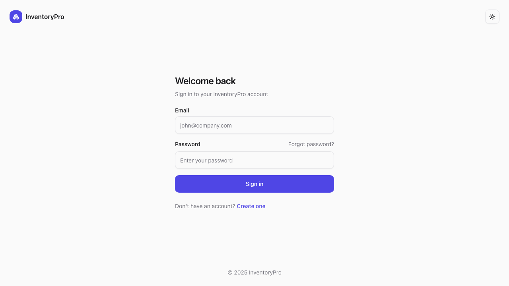
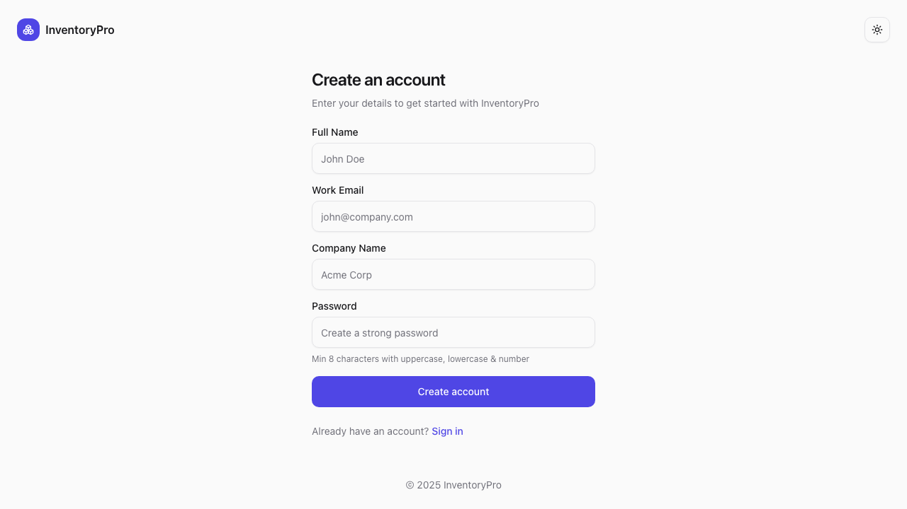
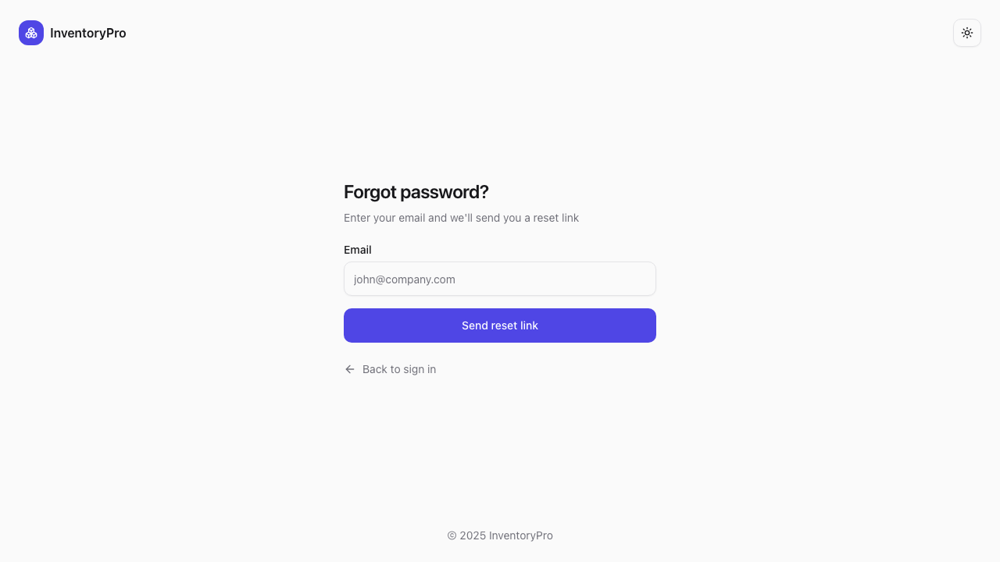

# Authentication

InventoryPro uses secure JWT-based authentication to protect your data.

## Login

Access the login page to sign in to your account.

### Steps to Login

1. Enter your **email address**
2. Enter your **password**
3. Click **Sign In**

> **Tip**: Check "Remember me" to stay logged in on this device.

## Register

New users can create an account through the registration page.

### Registration Fields

| Field | Description |
|-------|-------------|
| Name | Your full name |
| Email | Valid email address (will be your username) |
| Password | Minimum 8 characters |
| Company Name | Your organization name (creates a new tenant) |

### Steps to Register

1. Click **Create Account** on the login page
2. Fill in your details
3. Click **Register**
4. You'll be automatically logged in

## Forgot Password

If you've forgotten your password, you can reset it.

### Steps to Reset Password

1. Click **Forgot Password?** on the login page
2. Enter your email address
3. Click **Send Reset Link**
4. Check your email for the reset link
5. Follow the link to create a new password

## Session Management

- Sessions expire after 7 days of inactivity
- For security, always log out when using shared computers
- Admin users can view active sessions in Settings

## Security Features

- **JWT tokens** stored in httpOnly cookies (prevents XSS attacks)
- **Password hashing** using bcrypt
- **Rate limiting** on authentication endpoints
- **Audit logging** for all login/logout events
