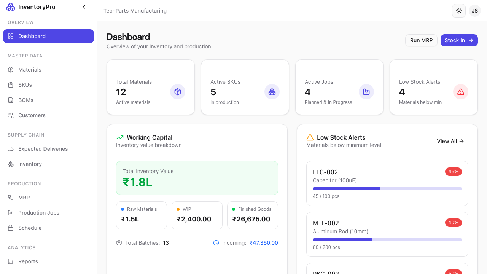

# Dashboard

The Dashboard is your command center for monitoring all aspects of your inventory and production.

## Overview

The dashboard provides at-a-glance visibility into:

- **Key Metrics**: Total materials, SKUs, active jobs, and pending deliveries
- **Low Stock Alerts**: Materials that need reordering
- **Recent Activity**: Latest transactions and updates
- **Quick Actions**: Common tasks accessible in one click

## Navigation Sidebar

The sidebar provides access to all modules:

| Section | Description |
|---------|-------------|
| **Dashboard** | Home screen with overview metrics |
| **Materials** | Raw material management |
| **SKUs** | Finished product catalog |
| **BOMs** | Bill of Materials definitions |
| **Jobs** | Production job tracking |
| **MRP** | Material Requirements Planning |
| **Inventory** | Stock levels and transactions |
| **Customers** | Customer database |
| **Deliveries** | Shipment management |
| **Schedule** | Calendar view of activities |
| **Reports** | Analytics and reporting |
| **Settings** | System configuration |
| **Audit Logs** | Activity history |

## Key Metrics Cards

The top of the dashboard displays important KPIs:

1. **Total Materials**: Count of raw materials in the system
2. **Total SKUs**: Number of finished products
3. **Active Jobs**: Production jobs currently in progress
4. **Pending Deliveries**: Shipments awaiting completion

## Low Stock Alerts

The dashboard highlights materials that are below their minimum stock level, helping you:

- Identify reorder needs quickly
- Prevent production delays
- Maintain optimal inventory levels

## Recent Activity

A timeline of recent events including:

- Stock-in and stock-out transactions
- New jobs started
- Deliveries completed
- User actions

## Quick Actions

Common tasks available directly from the dashboard:

- Add new material
- Create production job
- Record stock transaction
- Schedule delivery
