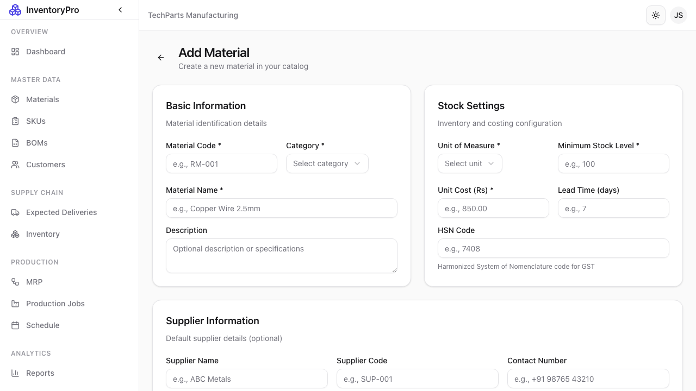
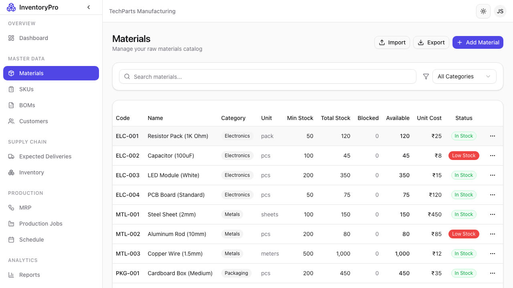

# Materials

Materials are the raw inputs used in your manufacturing process. InventoryPro provides comprehensive material management with FIFO batch tracking.

## Materials List

The materials page displays all your raw materials with key information:

| Column | Description |
|--------|-------------|
| **Code** | Unique material identifier |
| **Name** | Material description |
| **Category** | Classification for organization |
| **Unit** | Measurement unit (kg, pcs, liters, etc.) |
| **Current Stock** | Total quantity available |
| **Min Stock** | Reorder threshold |
| **Status** | Active or Inactive |

### Features

- **Search**: Find materials by code or name
- **Filter**: Filter by category or status
- **Sort**: Click column headers to sort
- **Export**: Download material list as CSV

## Adding a New Material

### Required Fields

| Field | Description |
|-------|-------------|
| **Material Code** | Unique identifier (e.g., "MAT-001") |
| **Name** | Descriptive name |
| **Category** | Select or create a category |
| **Unit of Measure** | How the material is counted |

### Optional Fields

| Field | Description |
|-------|-------------|
| **Description** | Detailed notes about the material |
| **Minimum Stock** | Alert threshold for low stock |
| **Maximum Stock** | Storage capacity limit |
| **Lead Time** | Days required for reordering |
| **Unit Cost** | Standard cost per unit |

### Steps to Add Material

1. Click **New Material** button
2. Fill in the required fields
3. Add optional details as needed
4. Click **Create Material**

## Material Detail View

Click on any material row to view its full details including:

- Complete material information
- Stock levels and batch history
- Transaction history
- Related BOMs using this material

## Editing Materials

1. Click on a material row to open details
2. Click **Edit** button
3. Make your changes
4. Click **Save Changes**

## Material Categories

Organize materials by category for easier management:

- Raw Materials
- Packaging
- Consumables
- Components
- Custom categories

## FIFO Batch Tracking

Materials are tracked using FIFO (First-In-First-Out):

- Each stock-in creates a new batch
- Stock-out automatically consumes oldest batches first
- Full traceability from receipt to consumption

## Best Practices

1. **Consistent Coding**: Use a standard format for material codes
2. **Set Min Stock**: Configure minimum levels for all critical materials
3. **Regular Reviews**: Periodically review inactive materials
4. **Accurate Units**: Ensure units match how materials are actually used
