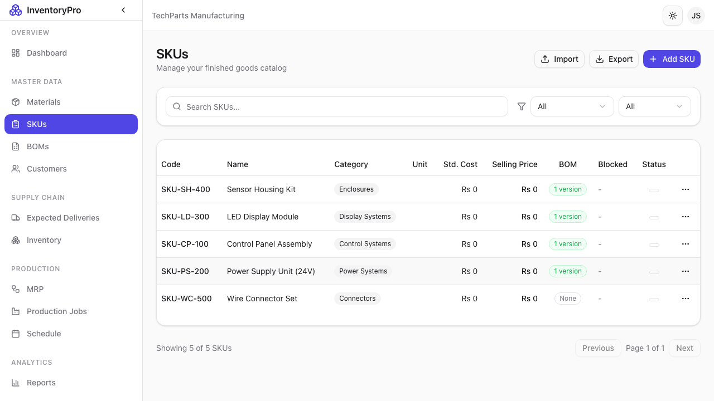
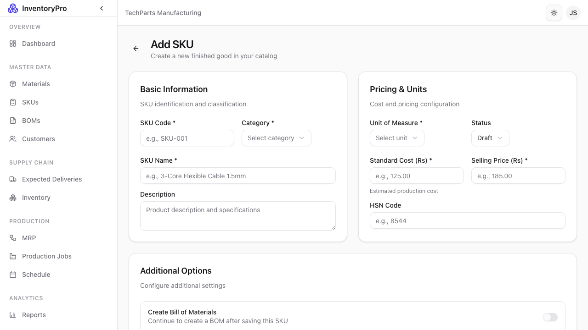
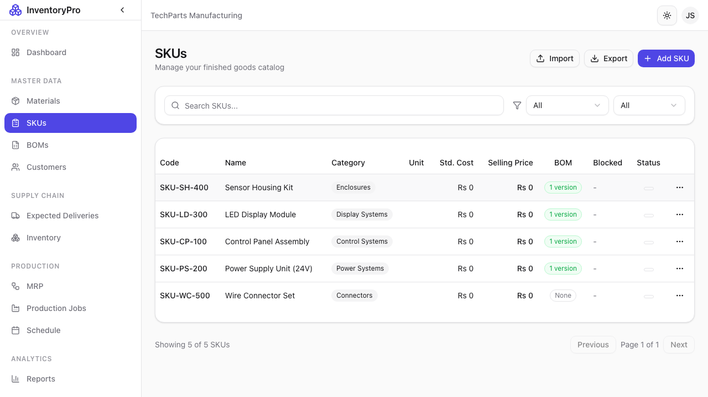

# SKUs (Products)

SKUs (Stock Keeping Units) represent your finished products that are manufactured and sold to customers.

## SKUs List

The SKUs page shows all your products with essential details:

| Column | Description |
|--------|-------------|
| **SKU Code** | Unique product identifier |
| **Name** | Product name |
| **Category** | Product classification |
| **Unit** | How the product is sold |
| **Price** | Selling price |
| **Status** | Active, Draft, or Discontinued |

### Features

- **Search**: Find SKUs by code or name
- **Filter**: Filter by category or status
- **Sort**: Click columns to sort
- **Export**: Download SKU catalog

## Adding a New SKU

### Required Fields

| Field | Description |
|-------|-------------|
| **SKU Code** | Unique identifier (e.g., "SKU-001") |
| **Name** | Product name |
| **Category** | Product category |
| **Unit of Measure** | Sales unit (pcs, sets, etc.) |

### Optional Fields

| Field | Description |
|-------|-------------|
| **Description** | Detailed product description |
| **Unit Price** | Standard selling price |
| **Min Stock** | Minimum inventory level |
| **Lead Time** | Production time in days |
| **Weight** | Product weight |
| **Dimensions** | Length, width, height |

### Steps to Create SKU

1. Click **New SKU** button
2. Enter the required information
3. Add pricing and optional details
4. Click **Create SKU**

## SKU Detail View

Click on any SKU row to view complete details including:

- Full product information
- Associated BOMs
- Inventory levels
- Production history

## SKU Categories

Organize products by category:

- Finished Goods
- Semi-Finished
- Assemblies
- Kits
- Custom categories

## SKU Lifecycle

SKUs follow a lifecycle:

| Status | Description |
|--------|-------------|
| **Draft** | Under development, not yet available |
| **Active** | Available for production and sale |
| **Discontinued** | No longer produced |

## Linking to BOMs

Each SKU can have one or more Bill of Materials (BOMs) that define how to manufacture it. See [Bill of Materials](06-boms) for details.

## Inventory Tracking

SKU inventory is tracked separately from materials:

- Stock levels updated when production jobs complete
- Reduced when deliveries are shipped
- Full transaction history available

## Best Practices

1. **Descriptive Names**: Use clear, consistent product names
2. **Accurate Pricing**: Keep prices updated for reporting
3. **Complete Details**: Fill in dimensions and weight for shipping
4. **Version Control**: Use Draft status for products in development
