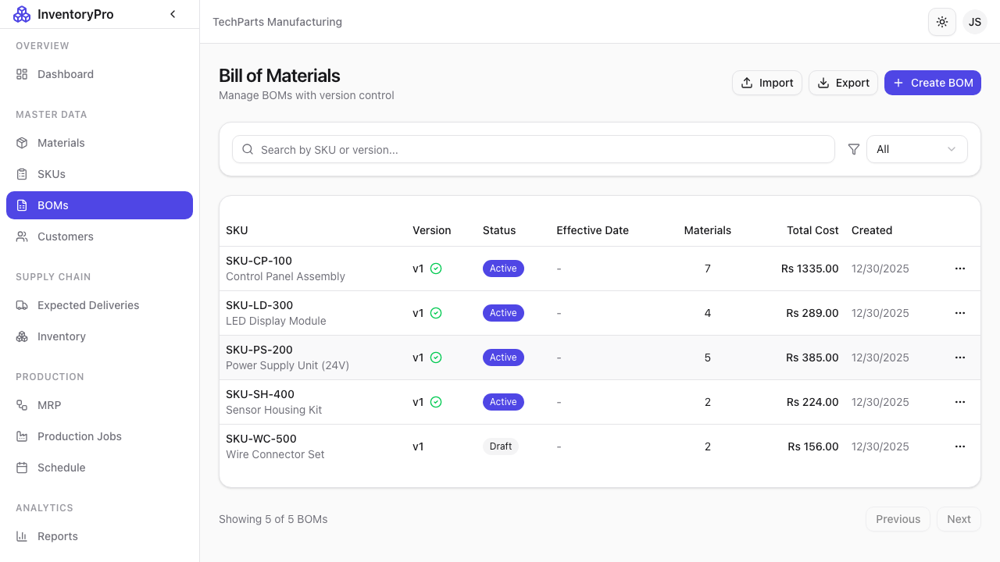
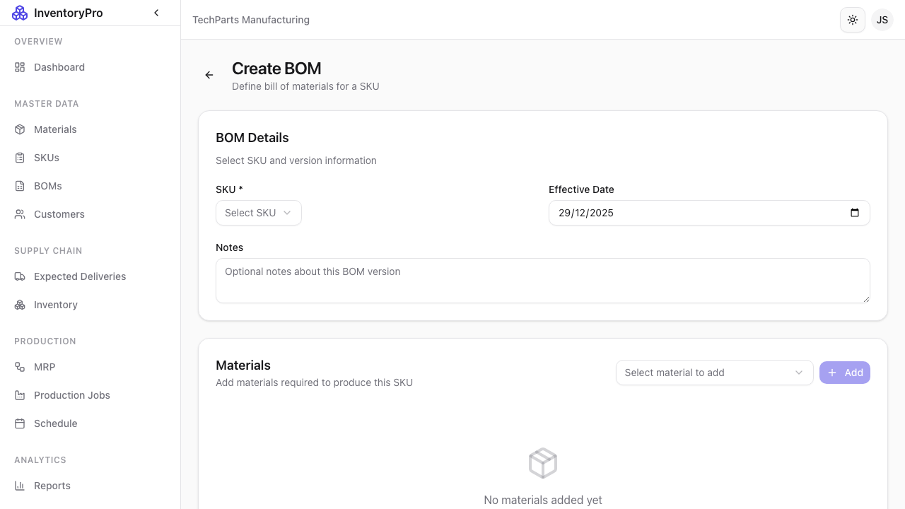
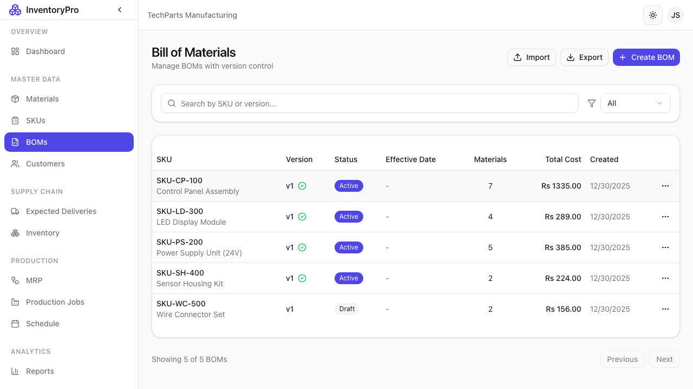

# Bill of Materials (BOM)

A Bill of Materials defines the recipe for manufacturing a product - the materials required and their quantities.

## BOM List



The BOM page displays all your product recipes:

| Column | Description |
|--------|-------------|
| **BOM Code** | Unique identifier |
| **SKU** | The product this BOM creates |
| **Version** | BOM version number |
| **Status** | Draft, Active, or Obsolete |
| **Output Qty** | Units produced per batch |
| **Materials** | Number of material lines |

### Features

- **Search**: Find BOMs by code or SKU
- **Filter**: Filter by status
- **Version History**: View all versions of a BOM

## Creating a New BOM



### Header Information

| Field | Description |
|-------|-------------|
| **BOM Code** | Unique identifier (e.g., "BOM-001") |
| **SKU** | Select the product to manufacture |
| **Version** | Version number (e.g., "1.0") |
| **Output Quantity** | Units produced per production run |
| **Notes** | Manufacturing instructions or notes |

### Adding Material Lines

For each material in the recipe:

| Field | Description |
|-------|-------------|
| **Material** | Select from material catalog |
| **Quantity** | Amount required per output unit |
| **Unit** | Material's unit of measure |
| **Scrap %** | Expected waste percentage |

### Steps to Create BOM

1. Click **New BOM** button
2. Select the target SKU
3. Enter header information
4. Add material lines with quantities
5. Click **Create BOM**

## BOM Detail View



Click on any BOM row to view complete details:

- Full recipe with all material lines
- Quantities and scrap percentages
- Version history
- Associated production jobs

## BOM Versioning

BOMs support version control for recipe changes:

| Status | Description |
|--------|-------------|
| **Draft** | Under development, cannot be used in production |
| **Active** | Current version, used for new jobs |
| **Obsolete** | Replaced by newer version, historical only |

### Version Workflow

1. Create initial BOM as Draft
2. Test and refine the recipe
3. Set status to Active when ready
4. When changes needed, create new version
5. Mark old version as Obsolete

## BOM Calculations

The system automatically calculates:

- **Material requirements** for any batch size
- **Scrap adjustments** based on percentages
- **Costs** based on material unit costs
- **Availability** based on current stock

## Multi-Level BOMs

For complex products, BOMs can reference sub-assemblies:

```
Finished Product
├── Sub-Assembly A (another SKU with its own BOM)
│   ├── Material 1
│   └── Material 2
└── Material 3
```

## Best Practices

1. **Version Everything**: Never edit active BOMs, create new versions
2. **Include Scrap**: Factor in realistic waste percentages
3. **Document Changes**: Use notes to explain version differences
4. **Regular Reviews**: Periodically verify BOM accuracy
5. **One Active Version**: Keep only one version Active per SKU
