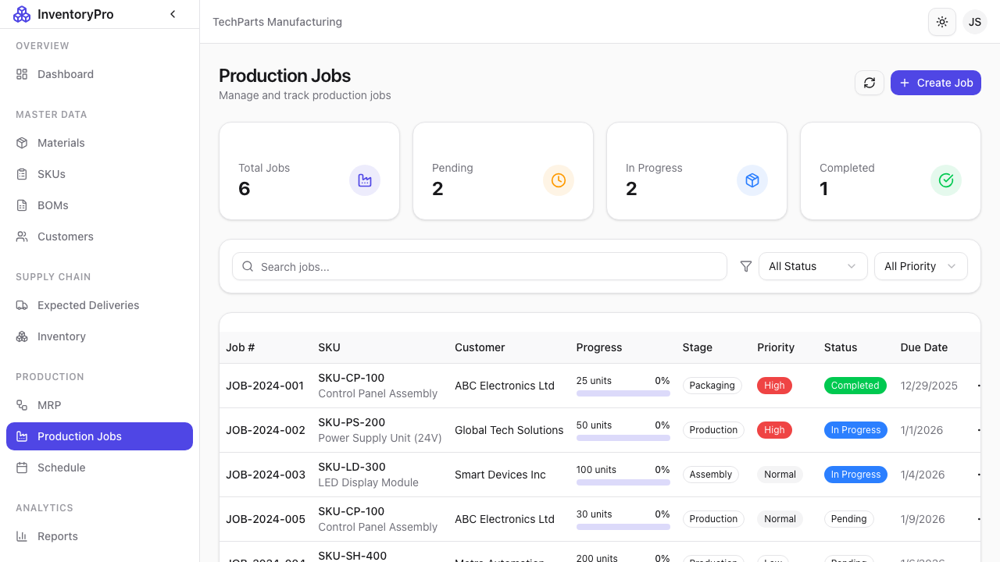
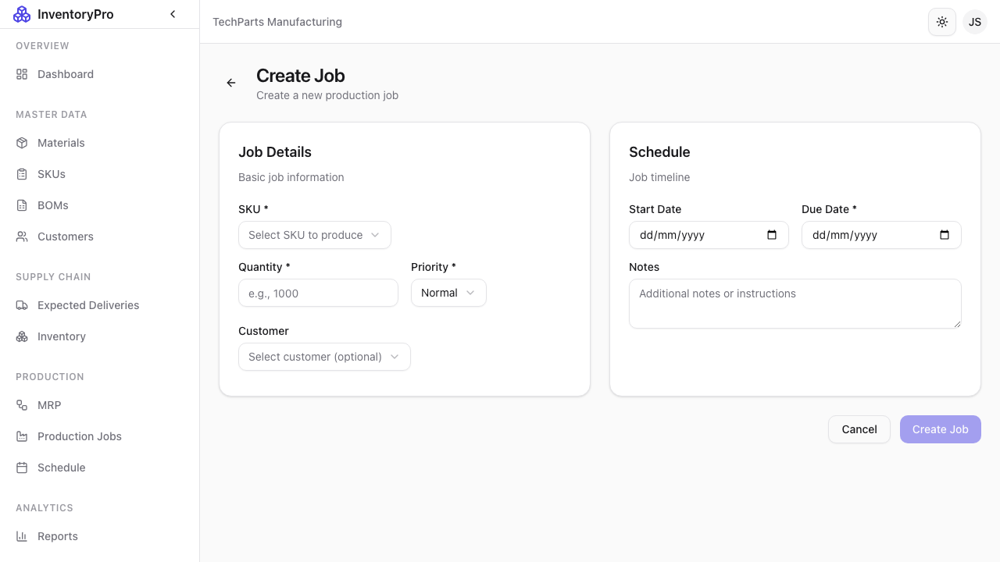

# Production Jobs

Production Jobs track manufacturing orders from start to completion, managing material consumption and SKU production.

## Jobs List



The jobs page shows all production orders:

| Column | Description |
|--------|-------------|
| **Job Number** | Unique job identifier |
| **SKU** | Product being manufactured |
| **BOM** | Recipe being used |
| **Quantity** | Target production quantity |
| **Status** | Current job status |
| **Start Date** | Planned or actual start |
| **Due Date** | Target completion date |
| **Progress** | Completion percentage |

### Job Statuses

| Status | Description |
|--------|-------------|
| **Draft** | Job created but not started |
| **Planned** | Scheduled for production |
| **In Progress** | Currently being manufactured |
| **Completed** | Finished successfully |
| **Cancelled** | Job was cancelled |

## Creating a New Job



### Required Fields

| Field | Description |
|-------|-------------|
| **SKU** | Select product to manufacture |
| **BOM** | Select which recipe to use |
| **Quantity** | Number of units to produce |
| **Start Date** | When to begin production |
| **Due Date** | Target completion date |

### Optional Fields

| Field | Description |
|-------|-------------|
| **Priority** | Low, Medium, High, or Urgent |
| **Notes** | Special instructions |
| **Assigned To** | User responsible |

### Steps to Create Job

1. Click **New Job** button
2. Select SKU and BOM
3. Enter quantity and dates
4. Review material requirements
5. Click **Create Job**

## Job Detail View


Click on any job row to view complete details:

- Job status and progress
- Material allocations and availability
- Production timeline
- Activity history

## Material Allocation

When a job is created, materials are automatically calculated:

- System checks if sufficient stock exists
- Materials can be reserved for the job
- Shortages are highlighted

## Job Workflow

```
Draft → Planned → In Progress → Completed
                       ↓
                  Cancelled
```

### Starting a Job

1. Open the job details
2. Click **Start Job**
3. Materials are allocated
4. Status changes to "In Progress"

### Completing a Job

1. Open the job details
2. Enter actual quantity produced
3. Record any scrap or waste
4. Click **Complete Job**
5. SKU inventory is increased
6. Materials are consumed

## Job Tracking

During production, you can track:

- **Progress**: Update completion percentage
- **Issues**: Log any problems encountered
- **Time**: Record actual labor hours
- **Scrap**: Document any defective output

## Material Consumption

Jobs consume materials automatically:

- Materials deducted using FIFO method
- Each allocation tracked to specific batches
- Full audit trail maintained

## Best Practices

1. **Check Availability**: Verify materials before creating jobs
2. **Realistic Dates**: Set achievable due dates
3. **Track Progress**: Update job status regularly
4. **Document Issues**: Record any production problems
5. **Close Promptly**: Complete jobs when finished
