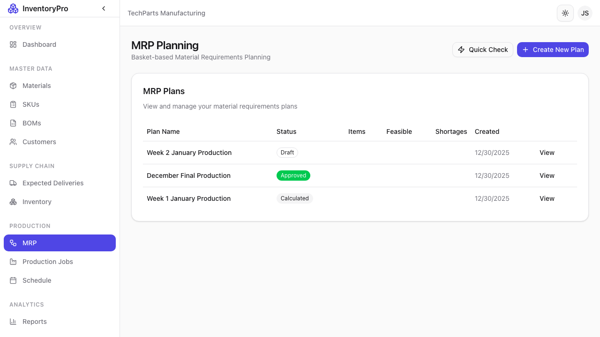

# MRP Planning

Material Requirements Planning (MRP) helps you plan production and ensure materials are available when needed.

## MRP Plans

The MRP module provides:

- **Demand forecasting** based on orders and history
- **Material requirements** calculation
- **Purchase suggestions** for shortages
- **Production scheduling** recommendations

## How MRP Works

MRP analyzes your data to answer:

1. **What** materials are needed?
2. **How much** of each material?
3. **When** are they needed?

### Inputs

| Data Source | Used For |
|-------------|----------|
| Sales Orders | Future demand |
| Current Inventory | Available stock |
| BOMs | Material requirements |
| Lead Times | Planning horizons |
| Min Stock Levels | Safety stock |

### Outputs

| Output | Description |
|--------|-------------|
| Purchase Orders | Materials to buy |
| Production Jobs | Items to manufacture |
| Timeline | When actions are needed |

## Creating an MRP Plan

1. Click **New MRP Plan**
2. Set the planning horizon (e.g., 30 days)
3. Select SKUs to include
4. Run the calculation
5. Review recommendations

## MRP Results

The plan shows:

### Material Requirements

| Material | Required | On Hand | Shortage |
|----------|----------|---------|----------|
| Material A | 1000 | 500 | 500 |
| Material B | 200 | 300 | 0 |

### Suggested Actions

- **Purchase**: Materials to order
- **Expedite**: Orders to speed up
- **Produce**: Jobs to create

## Planning Parameters

Configure MRP behavior:

| Parameter | Description |
|-----------|-------------|
| **Planning Horizon** | How far ahead to plan |
| **Safety Stock** | Extra buffer to maintain |
| **Lot Sizing** | Minimum order quantities |
| **Lead Time** | Time for materials to arrive |

## Running MRP

### Manual Run

1. Navigate to MRP module
2. Click **Run MRP**
3. Wait for calculation
4. Review results

### Scheduled Runs

Configure automatic MRP runs:
- Daily overnight
- Weekly planning cycles
- On-demand when needed

## Acting on Results

After reviewing MRP output:

1. **Create Purchase Orders**: For material shortages
2. **Create Production Jobs**: For SKU requirements
3. **Adjust Schedules**: If dates conflict
4. **Update Forecasts**: Refine future plans

## Best Practices

1. **Accurate Data**: MRP is only as good as your data
2. **Regular Updates**: Run MRP frequently
3. **Review Exceptions**: Focus on critical shortages
4. **Maintain Lead Times**: Keep supplier data current
5. **Safety Stock**: Set appropriate buffers
