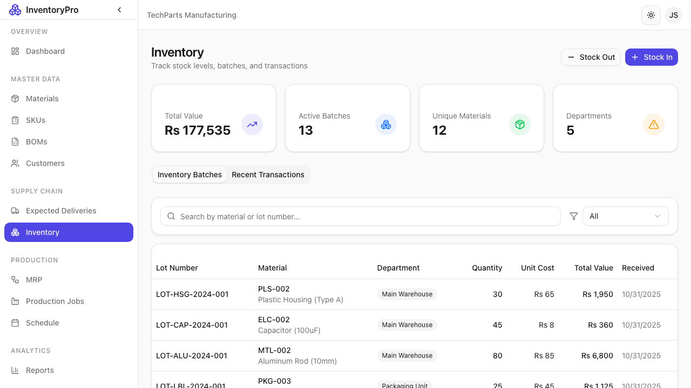
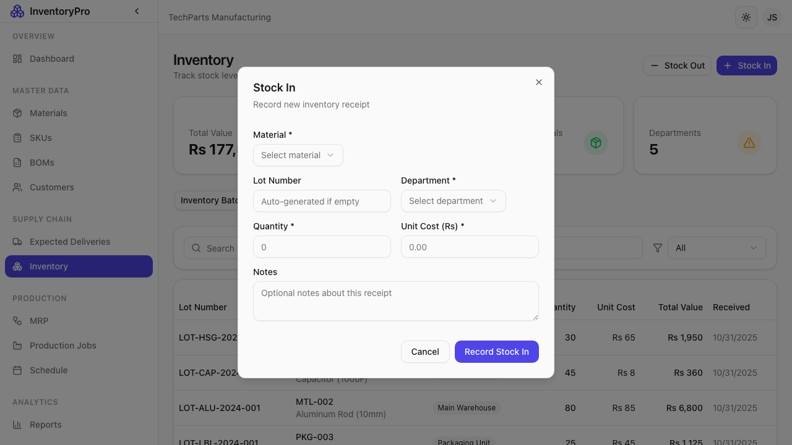
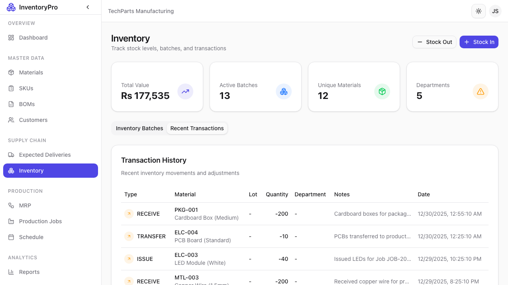

# Inventory Management

The Inventory module provides real-time visibility into stock levels, batch tracking, and transaction history.

## Inventory Batches

View all inventory batches with FIFO tracking:

| Column | Description |
|--------|-------------|
| **Batch Number** | Unique batch identifier |
| **Material** | Material in this batch |
| **Quantity** | Current quantity remaining |
| **Receipt Date** | When batch was received |
| **Expiry Date** | If applicable |
| **Location** | Storage location |
| **Status** | Available, Reserved, or Depleted |

## Stock-In (Receiving)

Record incoming inventory:

### Stock-In Fields

| Field | Description |
|-------|-------------|
| **Material** | Select material received |
| **Quantity** | Amount received |
| **Batch Number** | Supplier batch or auto-generated |
| **Receipt Date** | Date received |
| **Supplier** | Vendor information |
| **Unit Cost** | Cost per unit |
| **Expiry Date** | If material expires |
| **Location** | Storage location |
| **Notes** | PO number, quality notes, etc. |

### Steps to Record Stock-In

1. Click **Stock In** button
2. Select the material
3. Enter quantity and details
4. Click **Record Stock In**
5. New batch is created

## Stock-Out (Consumption)

Record inventory usage:

### Automatic Stock-Out

- Production jobs automatically consume materials
- FIFO method used (oldest batches first)
- Linked to job for traceability

### Manual Stock-Out

For non-production usage:

1. Click **Stock Out** button
2. Select material
3. Enter quantity
4. Select reason (Scrap, Adjustment, etc.)
5. Add notes
6. Click **Record Stock Out**

## Transaction History

Complete audit trail of all movements:

| Column | Description |
|--------|-------------|
| **Date/Time** | When transaction occurred |
| **Material** | Material affected |
| **Type** | Stock In, Stock Out, Adjustment |
| **Quantity** | Amount (+/-) |
| **Batch** | Source or destination batch |
| **Reference** | Job number, PO, etc. |
| **User** | Who performed the action |

### Filtering Transactions

- By date range
- By material
- By transaction type
- By user

## Inventory Adjustments

For corrections and cycle counts:

1. Navigate to the batch
2. Click **Adjust**
3. Enter new quantity
4. Provide reason
5. Click **Save Adjustment**

## Stock Levels

View aggregated stock by material:

| Material | On Hand | Reserved | Available | Min Stock |
|----------|---------|----------|-----------|-----------|
| MAT-001 | 500 | 100 | 400 | 200 |
| MAT-002 | 200 | 0 | 200 | 150 |

## Locations

Organize inventory by storage location:

- Warehouse zones
- Bin locations
- Quality hold areas

## Best Practices

1. **Timely Recording**: Log transactions immediately
2. **Batch Numbers**: Use meaningful batch identifiers
3. **Regular Counts**: Perform cycle counts frequently
4. **Document Reasons**: Always explain adjustments
5. **FIFO Compliance**: Let the system manage consumption order
