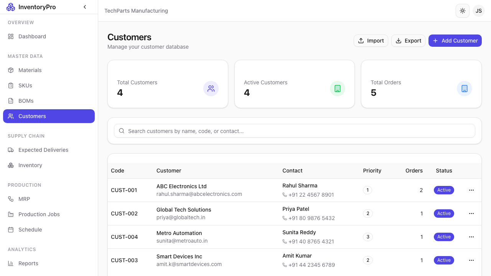

# Customers

The Customers module helps you manage your customer database, contacts, and relationship information.

## Customer List

View all customers with key details:

| Column | Description |
|--------|-------------|
| **Customer Code** | Unique identifier |
| **Name** | Company name |
| **Contact** | Primary contact person |
| **Email** | Contact email |
| **Phone** | Contact phone |
| **City** | Location |
| **Status** | Active or Inactive |

### Features

- **Search**: Find by name or code
- **Filter**: By status or location
- **Export**: Download customer list
- **Quick Actions**: Email, call, view deliveries

## Adding a New Customer

### Required Fields

| Field | Description |
|-------|-------------|
| **Customer Code** | Unique identifier (e.g., "CUST-001") |
| **Company Name** | Official business name |
| **Contact Name** | Primary contact person |
| **Email** | Primary email address |

### Address Information

| Field | Description |
|-------|-------------|
| **Address Line 1** | Street address |
| **Address Line 2** | Suite, building, etc. |
| **City** | City name |
| **State/Province** | State or province |
| **Postal Code** | ZIP or postal code |
| **Country** | Country |

### Additional Details

| Field | Description |
|-------|-------------|
| **Phone** | Main phone number |
| **Mobile** | Mobile contact |
| **Website** | Company website |
| **Tax ID** | Tax registration number |
| **Payment Terms** | Net 30, etc. |
| **Notes** | Internal notes |

### Steps to Add Customer

1. Click **New Customer** button
2. Fill in required fields
3. Add address and contact details
4. Set payment terms if applicable
5. Click **Create Customer**

## Customer Details

Click on a customer to view:

- **Overview**: Contact information summary
- **Deliveries**: All shipments to this customer
- **History**: Activity timeline
- **Notes**: Internal documentation

## Customer Contacts

Add multiple contacts per customer:

| Field | Description |
|-------|-------------|
| **Name** | Contact full name |
| **Title** | Job title |
| **Email** | Direct email |
| **Phone** | Direct phone |
| **Role** | Primary, Billing, Shipping, etc. |

## Customer Status

| Status | Description |
|--------|-------------|
| **Active** | Current customer |
| **Inactive** | Paused relationship |
| **Prospect** | Potential customer |

## Integration with Deliveries

Customers link directly to deliveries:

- Select customer when creating delivery
- Address auto-populates
- Delivery history tracked per customer

## Best Practices

1. **Complete Profiles**: Fill in all relevant information
2. **Multiple Contacts**: Add all key contacts
3. **Regular Updates**: Keep contact info current
4. **Notes**: Document important relationship details
5. **Consistent Coding**: Use standard customer codes
