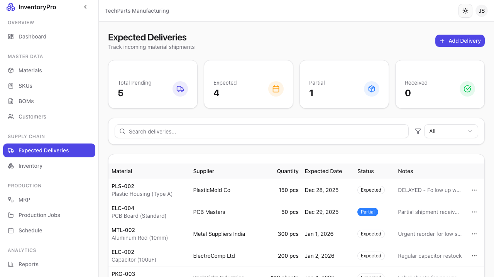

# Deliveries

The Deliveries module manages shipments of finished products to customers.

## Deliveries List



View all deliveries with tracking information:

| Column | Description |
|--------|-------------|
| **Delivery Number** | Unique identifier |
| **Customer** | Destination customer |
| **Ship Date** | Scheduled shipping date |
| **Status** | Current delivery status |
| **Items** | Number of line items |
| **Total** | Shipment value |

### Delivery Statuses

| Status | Description |
|--------|-------------|
| **Draft** | Being prepared |
| **Scheduled** | Confirmed for shipment |
| **In Transit** | Currently shipping |
| **Delivered** | Received by customer |
| **Cancelled** | Shipment cancelled |

## Creating a New Delivery

### Header Information

| Field | Description |
|-------|-------------|
| **Customer** | Select destination customer |
| **Ship Date** | Planned shipping date |
| **Delivery Date** | Expected arrival date |
| **Shipping Method** | Carrier or method |
| **Tracking Number** | Carrier tracking ID |
| **Notes** | Special instructions |

### Adding Line Items

For each product being shipped:

| Field | Description |
|-------|-------------|
| **SKU** | Product to ship |
| **Quantity** | Number of units |
| **Unit Price** | Selling price |
| **Notes** | Line-specific notes |

### Steps to Create Delivery

1. Click **New Delivery** button
2. Select the customer
3. Set shipping dates
4. Add SKU line items
5. Enter shipping details
6. Click **Create Delivery**

## Delivery Workflow

```
Draft → Scheduled → In Transit → Delivered
              ↓
          Cancelled
```

### Scheduling

1. Complete delivery details
2. Verify inventory available
3. Click **Schedule Delivery**
4. Status changes to Scheduled

### Shipping

1. Prepare shipment
2. Enter tracking number
3. Click **Mark as Shipped**
4. Status changes to In Transit
5. Inventory is reduced

### Completing

1. Confirm customer receipt
2. Click **Mark as Delivered**
3. Status changes to Delivered

## Inventory Impact

When a delivery ships:

- SKU inventory is reduced
- Transaction recorded
- Linked to customer record

## Shipping Documents

Generate shipping documentation:

- **Packing List**: Items in shipment
- **Delivery Note**: Customer copy
- **Invoice**: Billing document

## Delivery Calendar

View deliveries in calendar format (see [Schedule](12-schedule.md)):

- Scheduled shipments
- In-transit deliveries
- Delivery confirmations

## Best Practices

1. **Verify Stock**: Check inventory before scheduling
2. **Accurate Dates**: Set realistic delivery dates
3. **Track Everything**: Enter tracking numbers promptly
4. **Customer Communication**: Keep customers informed
5. **Document Issues**: Record any delivery problems
