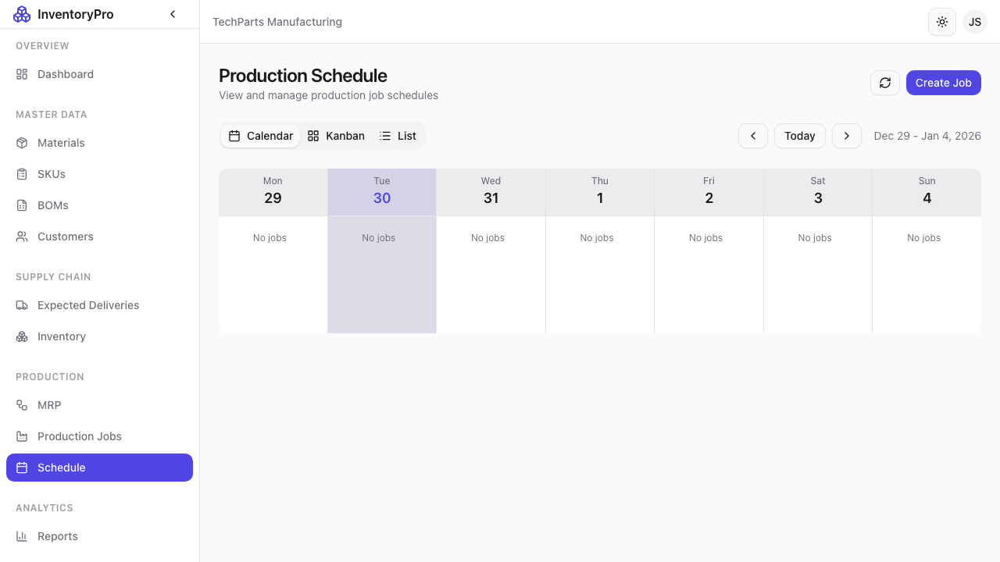

# Schedule

The Schedule module provides a calendar view of all production and delivery activities.

## Calendar View

The calendar displays:

- **Production Jobs**: Manufacturing schedules
- **Deliveries**: Shipping schedules
- **MRP Actions**: Planned activities

## Calendar Navigation

### Views

| View | Description |
|------|-------------|
| **Month** | Full month overview |
| **Week** | Detailed weekly view |
| **Day** | Hour-by-hour schedule |
| **Agenda** | List view of upcoming events |

### Navigation

- **Today**: Jump to current date
- **Previous/Next**: Move between periods
- **Date Picker**: Go to specific date

## Event Types

Events are color-coded by type:

| Color | Type | Description |
|-------|------|-------------|
| Blue | Production Job | Manufacturing activities |
| Green | Delivery | Shipments |
| Orange | MRP | Planning actions |
| Red | Overdue | Past due items |

## Production Schedule

View job timelines:

- Start and end dates
- Progress status
- Resource allocation

### Job Details

Click a job to see:

- SKU being produced
- Quantity and progress
- Materials required
- Assigned team

## Delivery Schedule

Track shipments:

- Scheduled ship dates
- Expected delivery dates
- Customer information

### Delivery Details

Click a delivery to see:

- Customer name
- Items being shipped
- Tracking information
- Delivery status

## Filtering

Filter the calendar view:

- By event type (Jobs, Deliveries)
- By status (Scheduled, In Progress)
- By SKU or customer
- By assigned user

## Creating from Calendar

Quick-create events:

1. Click on a date
2. Select event type
3. Fill in details
4. Save

## Calendar Sync

Export calendar data:

- iCal format
- Integration with external calendars
- Email notifications

## Capacity Planning

Visual capacity indicators:

- Workload per day/week
- Resource utilization
- Bottleneck identification

## Best Practices

1. **Regular Review**: Check calendar daily
2. **Balance Load**: Avoid overloading dates
3. **Buffer Time**: Allow slack for delays
4. **Update Promptly**: Keep dates current
5. **Use Filtering**: Focus on relevant events
