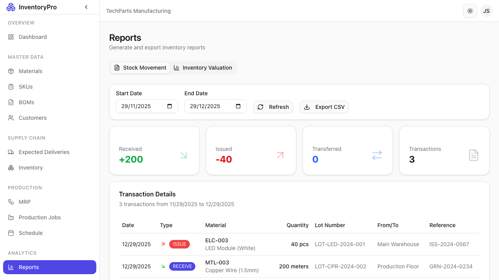

# Reports

The Reports module provides analytics and business intelligence for data-driven decisions.

## Reports Dashboard

Access various reports and analytics:

- Inventory reports
- Production reports
- Financial reports
- Custom reports

## Available Reports

### Inventory Reports

| Report | Description |
|--------|-------------|
| **Stock Levels** | Current inventory by material/SKU |
| **Stock Valuation** | Inventory value analysis |
| **Low Stock** | Materials below minimum |
| **Stock Movement** | Transaction history summary |
| **Aging Report** | Inventory by age/batch date |

### Production Reports

| Report | Description |
|--------|-------------|
| **Job Summary** | Production job statistics |
| **Material Consumption** | Materials used in production |
| **Production Output** | SKUs manufactured |
| **Efficiency Report** | Planned vs actual comparison |
| **Scrap Report** | Waste and defects analysis |

### Sales & Delivery Reports

| Report | Description |
|--------|-------------|
| **Delivery Summary** | Shipment statistics |
| **Customer Orders** | Orders by customer |
| **On-Time Delivery** | Delivery performance |
| **Revenue Report** | Sales analysis |

## Running Reports

### Steps

1. Select report type
2. Set date range
3. Choose filters (optional)
4. Click **Generate Report**
5. View results

### Report Parameters

Common parameters:

| Parameter | Description |
|-----------|-------------|
| **Date Range** | Start and end dates |
| **Materials** | Specific materials to include |
| **SKUs** | Specific products |
| **Customers** | Specific customers |
| **Status** | Filter by status |

## Report Output

### Viewing Results

- **Table View**: Detailed data rows
- **Charts**: Visual representations
- **Summary**: Key metrics

### Export Options

| Format | Use Case |
|--------|----------|
| **PDF** | Formal reports, printing |
| **Excel** | Further analysis |
| **CSV** | Data import/export |

## Scheduled Reports

Automate report generation:

1. Configure report
2. Set schedule (daily, weekly, monthly)
3. Add email recipients
4. Reports delivered automatically

## Dashboard Widgets

Add report widgets to your dashboard:

- Key metrics cards
- Trend charts
- Alert summaries

## Custom Reports

Build custom reports:

1. Select data sources
2. Choose columns
3. Apply filters
4. Set grouping/sorting
5. Save report

## Best Practices

1. **Regular Review**: Schedule key reports
2. **Export Data**: Keep historical records
3. **Share Insights**: Distribute to stakeholders
4. **Action Items**: Follow up on report findings
5. **Custom Views**: Create reports for your needs
