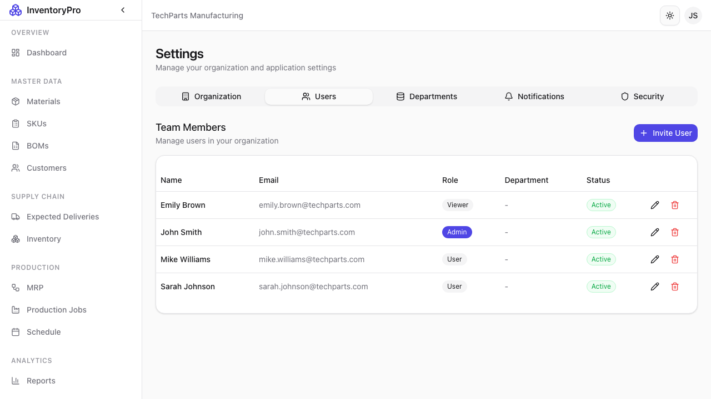
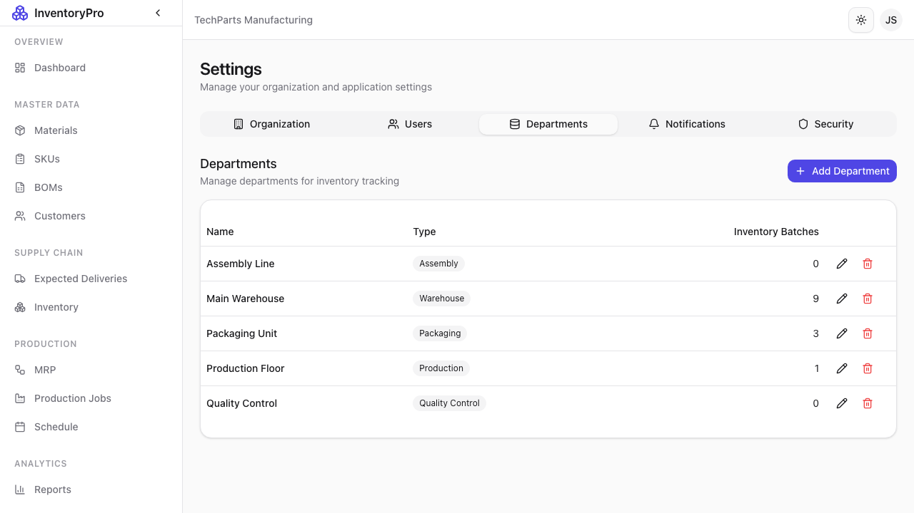
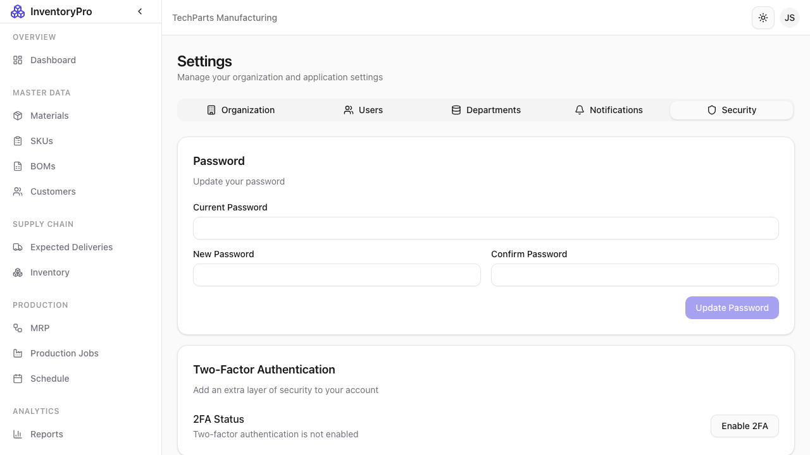

# Settings

The Settings module allows administrators to configure system options, manage users, and customize the application.

## Organization Settings

Configure your company profile:

| Setting | Description |
|---------|-------------|
| **Company Name** | Your organization name |
| **Address** | Business address |
| **Phone** | Contact number |
| **Email** | Primary contact email |
| **Website** | Company website |
| **Logo** | Company logo for documents |
| **Tax ID** | Tax registration number |

## User Management

### User List

View and manage system users:

| Column | Description |
|--------|-------------|
| **Name** | User's full name |
| **Email** | Login email |
| **Role** | Admin, User, or Viewer |
| **Status** | Active or Inactive |
| **Last Login** | Most recent access |

### Adding Users

1. Click **Add User**
2. Enter name and email
3. Select role
4. Click **Create User**
5. User receives email invitation

### User Roles

| Role | Permissions |
|------|-------------|
| **Admin** | Full access, user management, settings |
| **User** | Create, edit, delete records |
| **Viewer** | Read-only access |

### Editing Users

1. Click on user row
2. Modify details or role
3. Click **Save Changes**

### Deactivating Users

1. Click on user
2. Click **Deactivate**
3. User loses access immediately

## Department Settings

Organize users by department:

- Create departments
- Assign users
- Set department managers
- Configure permissions

## Security Settings

Configure security options:

### Password Policy

| Setting | Description |
|---------|-------------|
| **Minimum Length** | Required password length |
| **Complexity** | Require mixed characters |
| **Expiration** | Password change frequency |
| **History** | Prevent password reuse |

### Session Settings

| Setting | Description |
|---------|-------------|
| **Session Timeout** | Idle timeout duration |
| **Max Sessions** | Concurrent login limit |
| **Remember Me** | Duration for persistent login |

### Two-Factor Authentication

- Enable/disable 2FA requirement
- Configure authentication methods
- Manage user 2FA status

## System Configuration

### General Settings

| Setting | Description |
|---------|-------------|
| **Timezone** | System timezone |
| **Date Format** | Date display format |
| **Currency** | Default currency |
| **Language** | Interface language |

### Inventory Settings

| Setting | Description |
|---------|-------------|
| **FIFO Enforcement** | Require FIFO consumption |
| **Negative Stock** | Allow negative inventory |
| **Auto Batch Numbers** | Generate batch IDs |

### Notification Settings

Configure email notifications:

- Low stock alerts
- Job completion notices
- Delivery reminders
- System alerts

## Data Management

### Import/Export

- Import data from CSV
- Export system data
- Bulk updates

### Backup

- Schedule backups
- Download data exports
- Restore from backup

## Best Practices

1. **Regular Audits**: Review user access regularly
2. **Strong Passwords**: Enforce password policies
3. **Least Privilege**: Assign minimum necessary roles
4. **Document Changes**: Log configuration changes
5. **Test Settings**: Verify changes in non-production first
