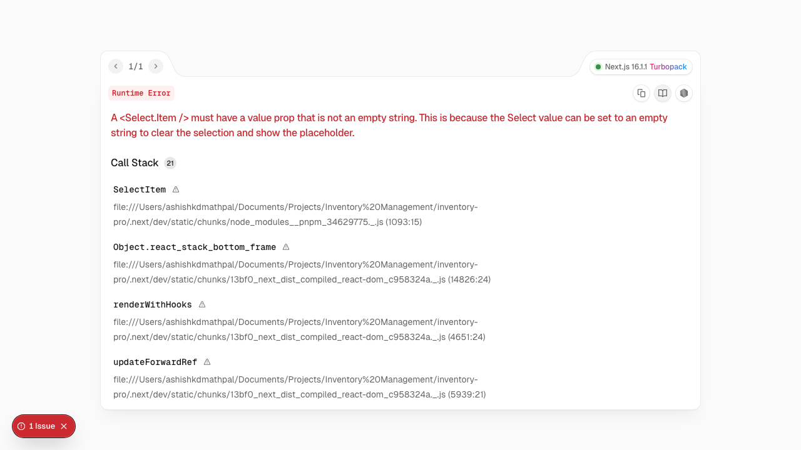

# Audit Logs

The Audit Logs module provides a complete activity history for compliance, troubleshooting, and security monitoring.

## Audit Log View

View all system activities:

| Column | Description |
|--------|-------------|
| **Timestamp** | When the action occurred |
| **User** | Who performed the action |
| **Action** | Type of activity |
| **Entity** | What was affected |
| **Entity ID** | Specific record |
| **Details** | Change description |
| **IP Address** | User's IP address |

## Tracked Actions

### Authentication Events

| Action | Description |
|--------|-------------|
| **LOGIN** | User logged in |
| **LOGOUT** | User logged out |
| **LOGIN_FAILED** | Failed login attempt |
| **PASSWORD_CHANGE** | Password was changed |
| **PASSWORD_RESET** | Password was reset |

### Data Changes

| Action | Description |
|--------|-------------|
| **CREATE** | New record created |
| **UPDATE** | Record modified |
| **DELETE** | Record deleted |

### Inventory Actions

| Action | Description |
|--------|-------------|
| **STOCK_IN** | Inventory received |
| **STOCK_OUT** | Inventory consumed |
| **ADJUSTMENT** | Stock level corrected |

### Production Actions

| Action | Description |
|--------|-------------|
| **JOB_START** | Production job started |
| **JOB_COMPLETE** | Production job finished |
| **JOB_CANCEL** | Production job cancelled |

## Filtering Logs

### Filter Options

| Filter | Description |
|--------|-------------|
| **Date Range** | Start and end dates |
| **User** | Specific user |
| **Action Type** | Specific action |
| **Entity Type** | Material, SKU, Job, etc. |
| **Search** | Text search in details |

### Quick Filters

- Today's activity
- This week
- Failed logins
- Data changes only

## Log Details

Click on a log entry to see:

- Full timestamp with timezone
- User information
- Before/after values for changes
- Related records
- Session information

## Searching Logs

Search capabilities:

- Free text search
- Entity ID lookup
- User activity history
- Change tracking

## Exporting Logs

Export for compliance or analysis:

| Format | Use Case |
|--------|----------|
| **CSV** | Spreadsheet analysis |
| **PDF** | Compliance reports |
| **JSON** | System integration |

## Retention Policy

Audit logs are retained based on configuration:

- Default: 90 days
- Extended: Up to 7 years
- Configurable by admin

## Security Monitoring

Use audit logs to detect:

- Unusual login patterns
- Multiple failed attempts
- Off-hours activity
- Bulk data changes
- Unauthorized access attempts

## Compliance

Audit logs support compliance with:

- SOC 2
- ISO 27001
- GDPR
- Industry regulations

## Best Practices

1. **Regular Review**: Check logs for anomalies
2. **Set Alerts**: Configure notifications for critical events
3. **Retain Appropriately**: Keep logs per compliance needs
4. **Secure Access**: Limit who can view audit logs
5. **Export Periodically**: Archive logs for long-term storage
